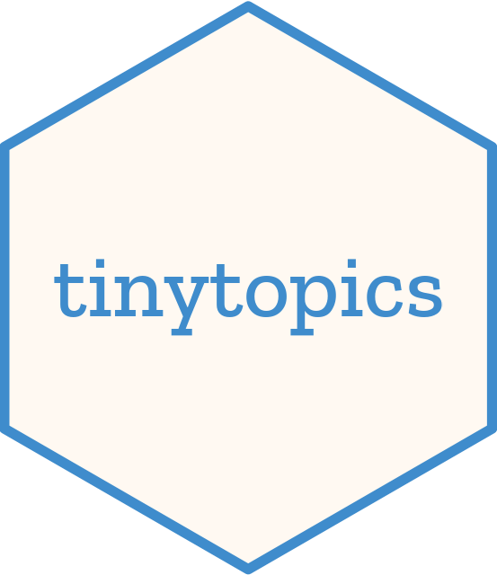

# tinytopics 

Topic modeling via sum-to-one constrained Poisson non-negative
matrix factorization (NMF), built on PyTorch and runs on GPU.

## Installation

First, [install PyTorch](https://pytorch.org/get-started/locally/).
To run on Nvidia GPUs, install a CUDA-enabled version on Linux or Windows.

You can install tinytopics from PyPI:

```bash
pip install tinytopics
```

Or install the development version from GitHub:

```bash
git clone https://github.com/nanxstats/tinytopics.git
cd tinytopics
python3 -m pip install -e .
```

Try [getting started](https://nanx.me/tinytopics/articles/get-started/).
