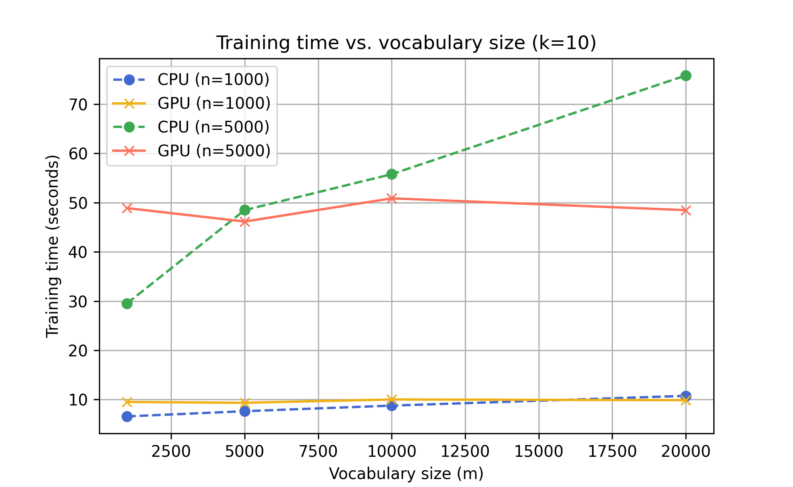
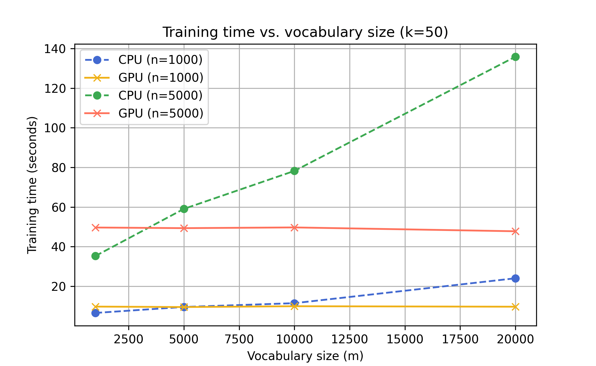
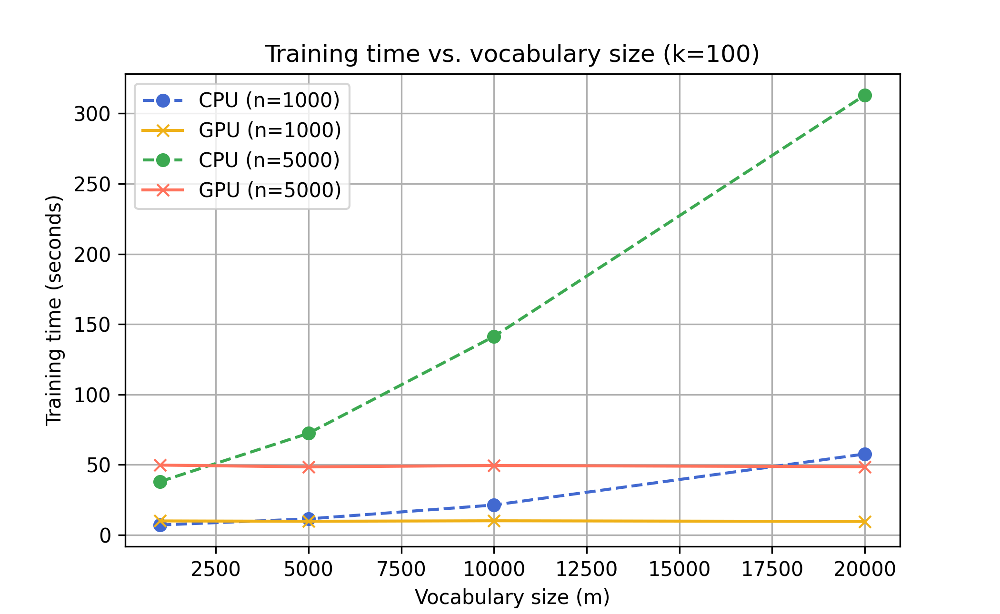

# CPU vs. GPU benchmark


<!-- `.md` and `.py` files are generated from the `.qmd` file. Please edit that file. -->

!!! tip

    To run the code from this article as a Python script:

    ```bash
    python3 examples/benchmark.py
    ```

In this article, we compare the topic model training speed on CPU
vs. GPU on mainstream consumer hardware. We will compare the time
consumed under combinations of the three key parameters defining the
problem size:

- Number of documents (`n`).
- Number of terms or vocabulary size (`m`).
- Number of topics (`k`).

Experiment environment:

- GPU: 1x NVIDIA GeForce RTX 4090 (16384 CUDA cores, 24GB VRAM)
- CPU: 1x AMD Ryzen 9 7950X3D (16 cores, 32 threads)
- RAM: DDR5 6000MHz 2x32GB

## Conclusions

- Training time grows linearly as the number of documents (`n`) grows,
  on both CPU and GPU.
- Similarly, training time grows as the number of topics (`k`) grows.
- With `n` and `k` fixed and vocabulary size (`m`) grows, CPU time will
  grow linearly while GPU time stays constant. For `m` larger than a
  certain threshold (1,000 to 5,000), training on GPU will be faster
  than CPU.

## Import tinytopics

``` python
import time
import torch
import pandas as pd
import matplotlib.pyplot as plt
from tinytopics.fit import fit_model
from tinytopics.utils import generate_synthetic_data, set_random_seed
from tinytopics.colors import scale_color_tinytopics
```

## Basic setup

Set seed for reproducibility:

``` python
set_random_seed(42)
```

Define parameter grids:

``` python
n_values = [1000, 5000]  # Number of documents
m_values = [1000, 5000, 10000, 20000]  # Vocabulary size
k_values = [10, 50, 100]  # Number of topics
avg_doc_length = 256 * 256
```

Create a data frame to store the benchmark results.

``` python
benchmark_results = pd.DataFrame()

def benchmark(X, k, device):
    start_time = time.time()
    model, losses = fit_model(X, k, device=device)
    elapsed_time = time.time() - start_time

    return elapsed_time
```

## Run experiment

``` python
for n in n_values:
    for m in m_values:
        for k in k_values:
            print(f"Benchmarking for n={n}, m={m}, k={k}...")

            X, true_L, true_F = generate_synthetic_data(n, m, k, avg_doc_length=avg_doc_length)

            # Benchmark on CPU
            cpu_time = benchmark(X, k, torch.device("cpu"))
            cpu_result = pd.DataFrame([{"n": n, "m": m, "k": k, "device": "CPU", "time": cpu_time}])

            if not cpu_result.isna().all().any():
                benchmark_results = pd.concat([benchmark_results, cpu_result], ignore_index=True)

            # Benchmark on GPU if available
            if torch.cuda.is_available():
                gpu_time = benchmark(X, k, torch.device("cuda"))
                gpu_result = pd.DataFrame([{"n": n, "m": m, "k": k, "device": "GPU", "time": gpu_time}])

                if not gpu_result.isna().all().any():
                    benchmark_results = pd.concat([benchmark_results, gpu_result], ignore_index=True)
```

Save results to a CSV file:

``` python
benchmark_results.to_csv("benchmark-results.csv", index=False)
```

## Visualize results

Plot the number of terms (`m`) against the time consumed, conditioning
on the number of documents (`n`), for each number of topics (`k`).

``` python
unique_series = len(n_values) * (2 if torch.cuda.is_available() else 1)
colormap = scale_color_tinytopics(unique_series)
colors_list = [colormap(i) for i in range(unique_series)]

for k in k_values:
    plt.figure(figsize=(7, 4.3), dpi=300)

    color_idx = 0
    for n in n_values:
        subset = benchmark_results[
            (benchmark_results["n"] == n) & (benchmark_results["k"] == k)
        ]

        # Plot CPU results with a specific color
        plt.plot(
            subset[subset["device"] == "CPU"]["m"],
            subset[subset["device"] == "CPU"]["time"],
            label=f"CPU (n={n})",
            linestyle="--",
            marker="o",
            color=colors_list[color_idx],
        )
        color_idx += 1

        # Plot GPU results if available
        if torch.cuda.is_available():
            plt.plot(
                subset[subset["device"] == "GPU"]["m"],
                subset[subset["device"] == "GPU"]["time"],
                label=f"GPU (n={n})",
                linestyle="-",
                marker="x",
                color=colors_list[color_idx],
            )
            color_idx += 1

    plt.xlabel("Vocabulary size (m)")
    plt.ylabel("Training time (seconds)")
    plt.title(f"Training time vs. vocabulary size (k={k})")
    plt.legend()
    plt.grid(True)
    plt.savefig(f"training-time-k-{k}.png", dpi=300)
    plt.close()
```






