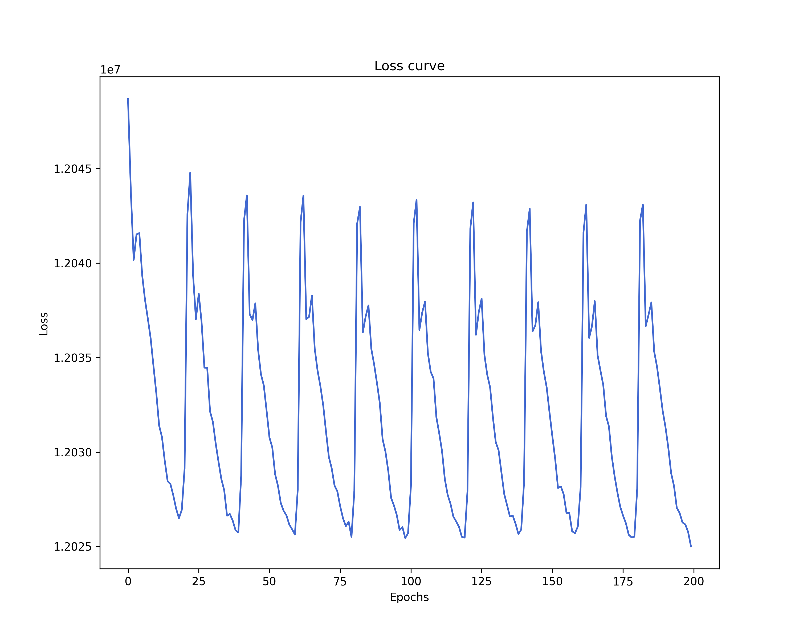

# Distributed training


<!-- `.md` and `.py` files are generated from the `.qmd` file. Please edit that file. -->

!!! tip

    The code from this article is available in:

    ```bash
    examples/distributed.py
    ```

    Follow the instructions in the article to run the code.

## Overview

tinytopics 0.7.0 supports distributed training using Hugging Face
Accelerate. This article shows how to run distributed training on a
single machine with multiple GPUs.

Note that Distributed Data Parallel (DDP) is used for distributed
training. This parallelism assumes that the model fits in GPU memory,
although the data might not fit in memory and can be stored on disk.
This is suitable for most topic modeling tasks as saving the factorized
low-rank matrices is less memory-intensive.

Hugging Face Accelerate also supports other distributed training
strategies such as Fully Sharded Data Parallel (FSDP) and DeepSpeed,
where the model tensors are split into different GPUs so that you can
train larger models.

## Generate data

100k x 100k matrix with 20 topics.

To generate data for distributed training, save the following code to
`examples/distributed_data.py` and run:

``` bash
python examples/distributed_data.py
```

``` python
import os

import numpy as np

import tinytopics as tt


def main():
    n, m, k = 100_000, 100_000, 20
    data_path = "X.npy"

    if os.path.exists(data_path):
        print(f"Data already exists at {data_path}")
        return

    print("Generating synthetic data...")
    tt.set_random_seed(42)
    X, true_L, true_F = tt.generate_synthetic_data(n, m, k, avg_doc_length=256 * 256)

    print(f"Saving data to {data_path}")
    X_numpy = X.cpu().numpy()
    np.save(data_path, X_numpy)


if __name__ == "__main__":
    main()
```

Since generating data is time-consuming (takes around 10 minutes),
running it separately helps avoid possible timeout errors when running
it as part of the distributed training code.

## Run distributed training

Run the following command to configure the distributed environment:

``` bash
accelerate config
```

Then save the following code to `examples/distributed.py` and run:

``` bash
accelerate launch examples/distributed.py
```

``` python
import os

from accelerate import Accelerator
from accelerate.utils import set_seed

import tinytopics as tt
from tinytopics.fit_distributed import fit_model_distributed


def main():
    accelerator = Accelerator()
    set_seed(42)
    k = 20
    data_path = "X.npy"

    if not os.path.exists(data_path):
        raise FileNotFoundError(
            f"Data file {data_path} not found. Run distributed_data.py first."
        )

    print(f"Loading data from {data_path}")
    X = tt.NumpyDiskDataset(data_path)

    # Ensure all processes have the data before proceeding
    accelerator.wait_for_everyone()

    model, losses = fit_model_distributed(X, k=k)

    # Only the main process should plot the loss
    if accelerator.is_main_process:
        tt.plot_loss(losses, output_file="loss.png")


if __name__ == "__main__":
    main()
```

1x H100 (80 GB SXM5): 24 seconds per epoch. GPU utilization is 16%, VRAM
1%.

4x H100 (80 GB SXM5): 7 seconds per epoch. GPU utilization is 20% to
40%, VRAM 4%.


Finishes training in 24 minutes (200 epochs).


