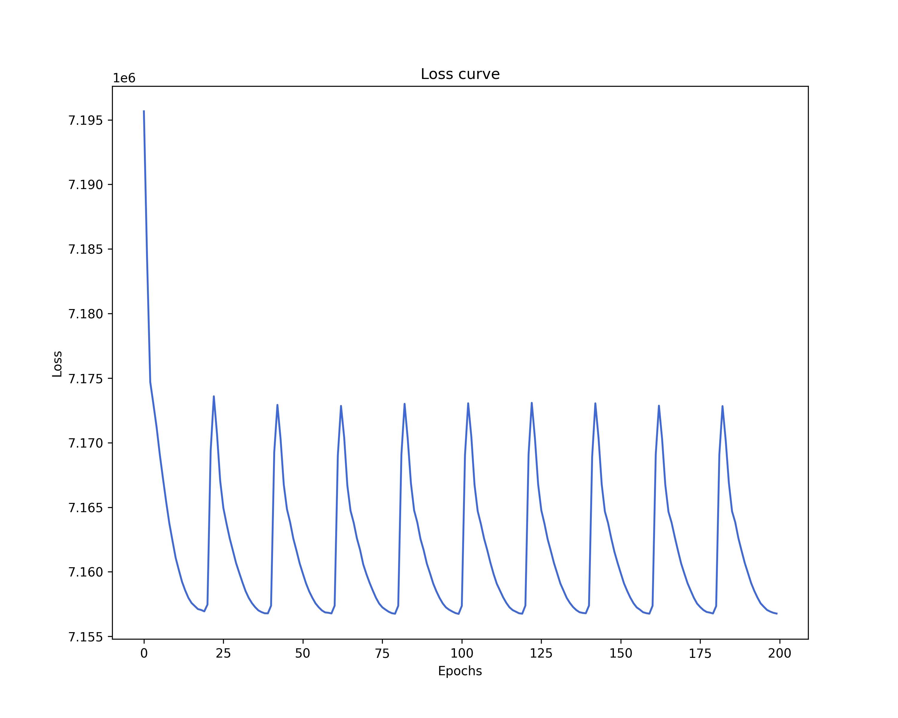
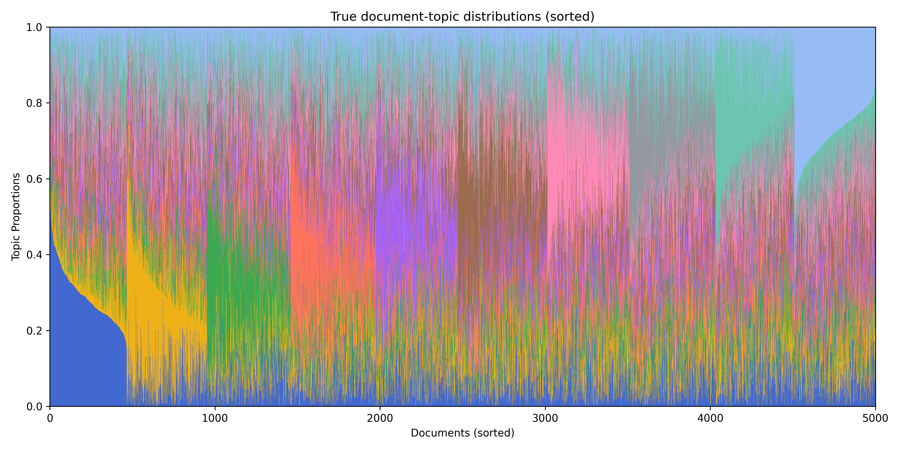
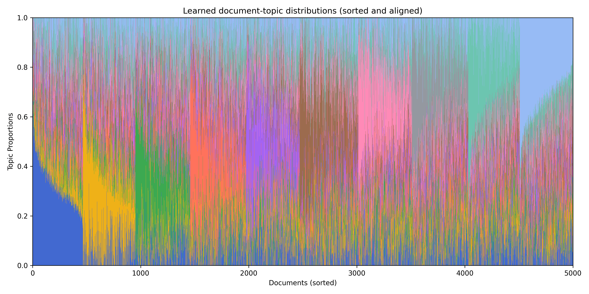
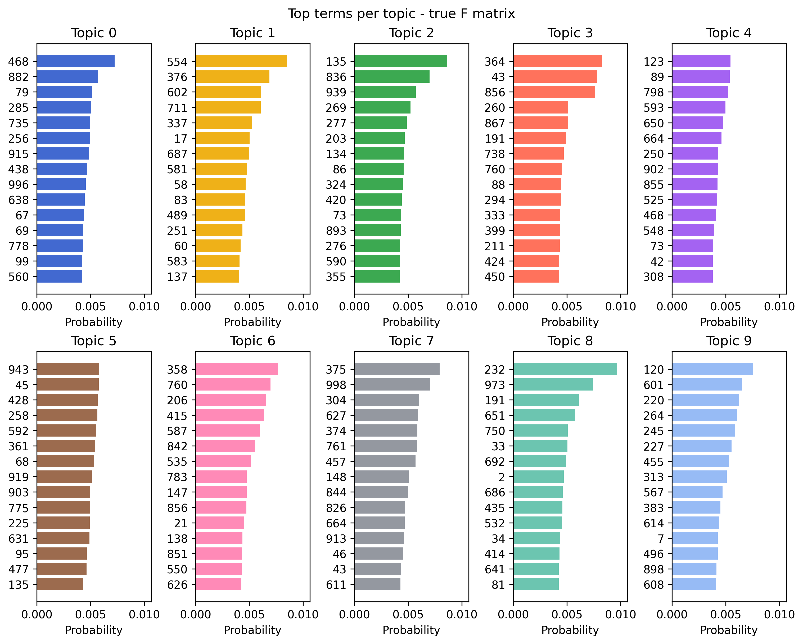

# Get started


<!-- `.md` and `.py` files are generated from the `.qmd` file. Please edit that file. -->

!!! tip

    To run the code from this article as a Python script:

    ```bash
    python3 examples/get-started.py
    ```

## Introduction

Fitting topic models at scale using classical algorithms on CPUs can be
slow. Carbonetto et al. (2022) demonstrated the equivalence between
Poisson NMF and multinomial topic model likelihoods, and proposed a
novel optimization strategy: fit a Poisson NMF via coordinate descent,
then recover the corresponding topic model through a simple
transformation. This method was implemented in their R package,
[fastTopics](https://cran.r-project.org/package=fastTopics).

Building on this theoretical insight, tinytopics adopts a more pragmatic
approach by directly solving a sum-to-one constrained neural Poisson
NMF, optimized using stochastic gradient methods, implemented in
PyTorch. This approach has a several benefits:

- Scalable: Runs efficiently on both CPUs and GPUs and enables
  large-scale topic modeling tasks.
- Extensible: The model architecture is flexible and can be extended,
  for example, by adding regularization or integrating with other data
  modalities.
- Minimal: The core implementation is kept simple and readable,
  reflecting the package name: **tiny**topics.

Let’s see how it works using a simulated dataset.

## Import tinytopics

``` python
from tinytopics.fit import fit_model
from tinytopics.plot import plot_loss, plot_structure, plot_top_terms
from tinytopics.utils import (
    set_random_seed,
    generate_synthetic_data,
    align_topics,
    sort_documents,
)
```

## Generate synthetic data

Set random seed for reproducibility and generate synthetic data

``` python
set_random_seed(42)

n, m, k = 5000, 1000, 10
X, true_L, true_F = generate_synthetic_data(n, m, k, avg_doc_length=256 * 256)
```

## Training

Train the model

``` python
model, losses = fit_model(X, k, learning_rate=0.01)
```

Plot loss curve

``` python
plot_loss(losses, output_file="loss.png")
```



!!! tip

    The performance of the model can be sensitive to the learning rate.
    If you experience suboptimal results or observe performance discrepancies
    between the model trained on CPU and GPU, tuning the learning rate can help.

    For example, using the default learning rate of 0.001 on this synthetic
    dataset can lead to inconsistent results between devices (worse model
    on CPU than GPU). Increasing the learning rate towards 0.01 significantly
    improves model fit and ensures consistent performance across both devices.

## Post-process results

Derive matrices

``` python
learned_L = model.get_normalized_L().numpy()
learned_F = model.get_normalized_F().numpy()
```

Align topics

``` python
aligned_indices = align_topics(true_F, learned_F)
learned_F_aligned = learned_F[aligned_indices]
learned_L_aligned = learned_L[:, aligned_indices]
```

Sort documents

``` python
sorted_indices = sort_documents(true_L)
true_L_sorted = true_L[sorted_indices]
learned_L_sorted = learned_L_aligned[sorted_indices]
```

## Visualize results

STRUCTURE plot

``` python
plot_structure(
    true_L_sorted,
    title="True Document-Topic Distributions (Sorted)",
    output_file="L-true.png",
)
```



``` python
plot_structure(
    learned_L_sorted,
    title="Learned Document-Topic Distributions (Sorted and Aligned)",
    output_file="L-learned.png",
)
```



Top terms plot

``` python
plot_top_terms(
    true_F,
    n_top_terms=15,
    title="Top Terms per Topic - True F Matrix",
    output_file="F-top-terms-true.png",
)
```



``` python
plot_top_terms(
    learned_F_aligned,
    n_top_terms=15,
    title="Top Terms per Topic - Learned F Matrix (Aligned)",
    output_file="F-top-terms-learned.png",
)
```


## References

Carbonetto, P., Sarkar, A., Wang, Z., & Stephens, M. (2021).
Non-negative matrix factorization algorithms greatly improve topic model
fits. arXiv Preprint arXiv:2105.13440.
